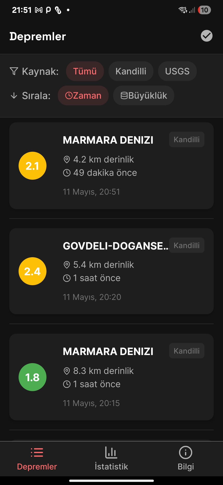
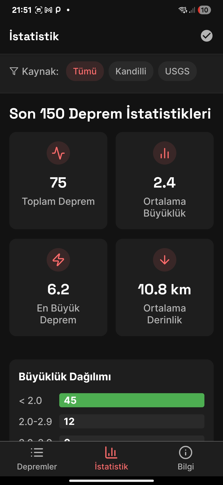
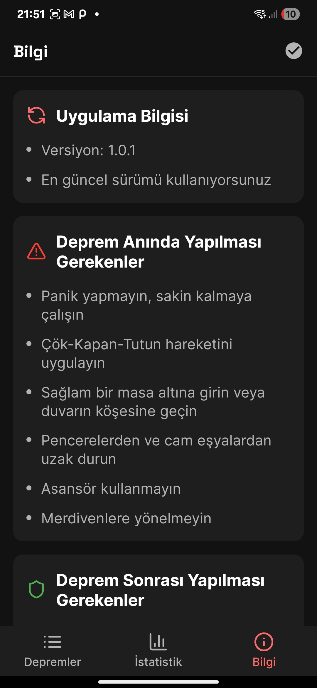

# 🌍 SisKip - Türkiye Deprem Takip Uygulaması

  
   
  <h3>Gerçek Zamanlı Deprem Bilgilendirme Sistemi</h3>

## 📱 Uygulama Hakkında

SisKip, Türkiye'deki deprem aktivitelerini gerçek zamanlı olarak takip etmenizi sağlayan modern bir mobil uygulamadır. Kandilli Rasathanesi ve USGS (Amerika merkezli deprem ölçüm) verilerini kullanarak, deprem bilgilerini anlık olarak kullanıcılara ulaştırır.

Kullanılan veri merkzlerinden kaynaklı gecikme yaşanabilir

### ✨ Özellikler

- 🔄 Gerçek zamanlı deprem verileri
- 📊 Detaylı istatistikler ve analizler
- 🗺️ Deprem lokasyonlarını harita üzerinde görüntüleme
- 📱 Modern ve kullanıcı dostu arayüz
- 🌙 Karanlık mod desteği

## 📸 Ekran Görüntüleri

  <!-- Ekran görüntüleri buraya eklenecek -->
  
  
  

## 🚀 Kurulum
GitHub releases sayfasından en son APK dosyasını indirin. Açın ve kullanmaya başlayın. Uygulama hiçbir izin istemez

## 🛠️ Teknik Özellikler

- **Framework**: React Native & Expo
- **Dil**: TypeScript
- **Veri Kaynakları**: Kandilli Rasathanesi, AFAD
- **Harita**: React Native Maps
- **Grafikler**: React Native Charts
- **Tasarım**: Custom UI Components, One UI Design System
- **State Management**: React Context API
- **Navigation**: Expo Router

## 🔄 Güncellemeler

Uygulama otomatik güncelleme sistemine sahiptir. Yeni bir sürüm çıktığında, uygulama sizi bilgilendirecek ve güncelleme yapmanızı sağlayacaktır.

## 👨‍💻 Geliştirici

SisKip, Türk yazılım geliştiricileri tarafından, toplum yararına açık kaynak olarak geliştirilmektedir.

## 🤝 Katkıda Bulunma

Projeye katkıda bulunmak isterseniz:

1. Bu repo'yu fork edin
2. Yeni bir branch oluşturun (`git checkout -b feature/amazing-feature`)
3. Değişikliklerinizi commit edin (`git commit -m 'feat: Add amazing feature'`)
4. Branch'inizi push edin (`git push origin feature/amazing-feature`)
5. Pull Request oluşturun

## 📝 Lisans

Bu proje GNU General Public License v3.0 (GPL-3.0) lisansı altında lisanslanmıştır. Bu, yazılımı özgürce kullanabileceğiniz, değiştirebileceğiniz ve dağıtabileceğiniz anlamına gelir, ancak türetilmiş çalışmalar da aynı lisans altında paylaşılmalıdır. Daha fazla bilgi için [LICENSE](LICENSE) dosyasına bakın.

## 📞 İletişim

- GitHub: [@SiberizmDev](https://github.com/SiberizmDev)
- Instagram: [@nexabag.media](https://instagram.com/nexabag.media)
- E-posta: siberizmbey@gmail.com

## ⚠️ Sorumluluk Reddi

Bu uygulama sadece bilgilendirme amaçlıdır. Resmi kurumların açıklamalarını takip etmenizi öneririz.

---

  Made with ❤️ in Türkiye

 